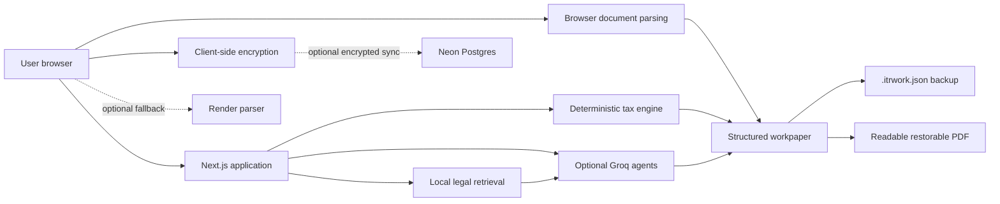

# ITR Compass

**Prepare, compare, and review your income-tax workpaper.**

ITR Compass is a privacy-first, evidence-backed Indian income-tax preparation workspace for **FY 2025–26 / AY 2026–27**. It helps users organise tax documents, review extracted values, compare old and new tax regimes, screen potential ITR forms, run controlled AI-assisted checks, and export a portable workpaper.

> **Important:** ITR Compass is independent preparation and reconciliation software. It is not affiliated with or endorsed by the Income Tax Department. It does not submit a return, pay tax, e-verify, certify facts, determine disputed legal positions, or replace a practising tax professional.

## Repository

**GitHub:** [github.com/thanos07/itr-compass](https://github.com/thanos07/itr-compass)

## Highlights

- Privacy-first, local-by-default workspace
- FY 2025–26 / AY 2026–27 deterministic tax calculations
- Old-versus-new regime comparison
- Potential ITR-1, ITR-2, ITR-3 and ITR-4 screening
- Browser parsing for PDF, JSON, CSV, XLSX and text files
- Optional Render parser for wider and password-protected file support
- Reviewable document claims with source locators and confidence values
- Four user-triggered Groq agents
- Local assessment-year-aware legal retrieval
- Portable `.itrwork.json` backup and restore
- Readable PDF workpaper with an encrypted, restorable workspace attachment
- Optional client-encrypted Neon workspace recovery
- Separate recovery, update and deletion capabilities
- Cream and blue interface themes
- Nonce-based Content Security Policy
- Legal methodology, privacy, terms and security pages
- Vercel, Render and Neon deployment configuration

## What the application does

### 1. Collects source documents

Users can add common tax documents such as:

- Form 16
- AIS and TIS
- Form 26AS
- Prefill or ITR JSON
- Bank statements
- Broker and capital-gain statements
- CSV, XLSX and supported text files

Supported files are parsed in the browser first. The optional Render worker is used only for formats or cases that need server-side processing.

### 2. Keeps extracted values reviewable

Document extraction creates candidate claims rather than silently changing the return. Each claim can include:

- source document
- field mapping
- extracted value
- confidence score
- source locator
- accepted or pending status

The user remains in control of which values are accepted into the workpaper.

### 3. Runs deterministic tax calculations

The tax engine compares supported old- and new-regime outcomes using versioned TypeScript rules for AY 2026–27.

The application intentionally blocks or warns when a reliable calculation is outside its implemented scope.

### 4. Screens potential ITR forms

The form selector screens for potential:

- ITR-1
- ITR-2
- ITR-3
- ITR-4

The result is described as a **potential candidate** or **safer fallback**, not as a legal certification.

### 5. Runs controlled AI-assisted review

The Agent Desk provides four user-triggered workflows:

1. **Document Intake Agent** — reviews the document inventory, parser warnings and missing evidence categories.
2. **Reconciliation Agent** — compares source claims, accepted values and workpaper fields.
3. **Legal Retrieval Agent** — retrieves assessment-year-filtered material from a curated official-source corpus and limits returned citations to retrieved source IDs.
4. **Final Review Agent** — combines deterministic tax and form results with evidence controls and prior agent summaries to identify unresolved handoff issues.

Tax calculations remain deterministic. The agents do not submit returns, autonomously loop, invent unsupported amounts or replace professional advice.

See [`docs/AGENTS.md`](docs/AGENTS.md).

## Legal-design choices

ITR Compass deliberately avoids several unsafe assumptions:

- Section 44ADA is not inferred from an occupation or activity label alone.
- Section 44ADA screening requires an explicit profession confirmation under section 44AA(1), receipt facts and presumptive-income checks.
- Section 87A eligibility is based on total income.
- Supported special-rate tax is not automatically offset by the rebate.
- Presumptive profit is never converted into an invented cash-in-hand value.
- AIS, TIS and broker labels are treated as reconciliation evidence, not conclusive legal classification.
- Successful parsing or JSON-schema validation is not described as legal correctness.
- Unsupported calculations produce blockers or warnings instead of confident estimates.

See [`docs/SOURCE_AUDIT.md`](docs/SOURCE_AUDIT.md) and the in-product `/legal` page.

## Technology stack

### Web application

- Next.js 16
- React 19
- TypeScript
- Tailwind CSS 4
- `pdfjs-dist` for browser PDF processing
- `pdf-lib` for readable and restorable PDF reports
- Papa Parse for CSV
- SheetJS for spreadsheets
- Zod for workspace and API validation
- Lucide icons
- Fraunces and IBM Plex fonts

### Optional services

- Neon Postgres
- Drizzle ORM
- Groq API
- Render
- FastAPI
- pypdf
- defusedxml
- openpyxl

## Architecture



Every external integration is optional:

| Configuration | Available capabilities |
|---|---|
| Vercel only | Local workpaper, deterministic calculation, browser parsing, JSON backup and PDF report |
| Vercel + Render | Wider document parsing and password-protected file fallback |
| Vercel + Neon | Client-encrypted cloud recovery |
| Vercel + Groq | Controlled extraction fallback and four review agents |

## Local development

### Requirements

- Node.js 20 or newer
- npm
- Python 3.11 or newer for the optional parser worker

### 1. Clone the repository

```bash
git clone https://github.com/thanos07/itr-compass.git
cd itr-compass
```

### 2. Create the local environment file

#### Windows PowerShell

```powershell
Copy-Item .env.example .env.local
```

#### macOS or Linux

```bash
cp .env.example .env.local
```

Add only the integrations needed for local testing.

### 3. Install and start the web application

```bash
npm install
npm run dev
```

Open `http://localhost:3000`.

## Optional parser worker

The parser worker is not required for browser-supported files.

### Windows PowerShell

```powershell
cd worker
python -m venv .venv
.\.venv\Scripts\Activate.ps1
pip install -r requirements.txt
uvicorn main:app --reload --port 8000
```

### macOS or Linux

```bash
cd worker
python -m venv .venv
source .venv/bin/activate
pip install -r requirements.txt
uvicorn main:app --reload --port 8000
```

Then set:

```env
NEXT_PUBLIC_PARSER_URL=http://localhost:8000
```

## Environment variables

Copy `.env.example` to `.env.local`. Never commit `.env.local`, API keys or database credentials.

### Public application configuration

| Variable | Required | Purpose |
|---|---:|---|
| `NEXT_PUBLIC_SITE_URL` | production | Public Vercel URL or custom domain used for metadata |
| `NEXT_PUBLIC_PARSER_URL` | no | Optional Render or local parser URL |
| `NEXT_PUBLIC_OPERATOR_NAME` | public launch | Public service-operator name |
| `NEXT_PUBLIC_OPERATOR_URL` | no | Public operator or portfolio URL |
| `NEXT_PUBLIC_PRIVACY_CONTACT` | public launch | Monitored privacy contact |
| `NEXT_PUBLIC_SECURITY_CONTACT` | public launch | Private vulnerability-reporting contact |
| `NEXT_PUBLIC_LEGAL_CONTACT` | public launch | Monitored legal and support contact |

### Optional server-side integrations

| Variable | Required | Purpose |
|---|---:|---|
| `DATABASE_URL` | no | Neon pooled Postgres connection string |
| `GROQ_API_KEY` | no | Enables constrained extraction and the four agents |
| `GROQ_MODEL` | no | Extraction model |
| `GROQ_AGENT_MODEL` | no | Agent model |
| `AI_REQUESTS_PER_MINUTE` | no | Best-effort extraction throttle |
| `AGENT_REQUESTS_PER_MINUTE` | no | Best-effort agent throttle |
| `CLOUD_REQUESTS_PER_MINUTE` | no | Best-effort cloud API throttle |
| `MAX_CLOUD_PAYLOAD_BYTES` | no | Maximum encrypted cloud payload |
| `CSP_REPORT_ONLY` | no | Enables report-only CSP testing when set to `true` |

Recommended model configuration:

```env
GROQ_MODEL=openai/gpt-oss-20b
GROQ_AGENT_MODEL=openai/gpt-oss-20b
```

### Parser worker variables

| Variable | Purpose |
|---|---|
| `ALLOWED_ORIGINS` | Comma-separated exact web origins allowed to call the parser |
| `MAX_UPLOAD_MB` | Maximum uploaded file size |
| `MAX_EXPANDED_MB` | ZIP and DOCX expansion safety limit |

## Backups and handoff

### JSON workspace backup

The `.itrwork.json` format is the most reliable portable workspace backup. It contains structured workpaper data, but not the original uploaded files.

### Restorable PDF report

The application can generate a readable PDF workpaper containing:

- taxpayer inputs
- form screening
- regime comparison
- tax calculation breakdown
- eligibility inputs
- document inventory
- accepted claims
- agent summaries and findings
- handoff checklist

The PDF also contains an encrypted workspace attachment that can be restored through the application.

Important behavior:

- The visible PDF report is readable without the backup password.
- The embedded workspace is encrypted using the browser-side encryption flow.
- The password is not stored by the application.
- Printing, scanning, compressing or editing the PDF may remove the embedded attachment.
- Keep the `.itrwork.json` backup as the primary restoration format.

## Privacy and security architecture

- Browser parsing is attempted first.
- Raw files are not stored in Neon.
- Stored previews redact common PAN, Aadhaar, IFSC, email and Indian mobile-number patterns.
- Agent requests re-apply server-side redaction.
- Agent payloads are length-limited.
- Optional cloud workspaces are encrypted in the browser using AES-256-GCM.
- Encryption keys are derived with PBKDF2.
- The recovery key is stored after `#` in a recovery URL, so normal HTTP navigation does not send it to the server.
- Neon receives ciphertext, IV, salt, schema version, token hashes and expiry metadata.
- Recovery and owner secrets remain in URL fragments and local UI state.
- Update and deletion require separate owner capabilities.
- Workspace imports are validated against a bounded schema.
- The parser worker is stateless at the application level.
- DOCX XML processing uses hardened parsing.
- Strict request limits and payload limits reduce accidental or abusive usage.

Pattern redaction, browser encryption and stateless processing do not eliminate the deployment operator's legal and security responsibilities.

Read [`SECURITY.md`](SECURITY.md) before a public launch.

## Content Security Policy

ITR Compass uses a per-request, nonce-based Content Security Policy generated by `src/proxy.ts`.

Production `script-src` does not rely on unrestricted inline scripts or `unsafe-eval`. The theme bootstrap and Next.js framework scripts are authorised with the request nonce.

Nonce generation requires dynamic rendering of the root layout. This uses more request-time compute than a fully static export but provides stronger script-injection protection for an application handling financial information.

For initial deployment testing only:

```env
CSP_REPORT_ONLY=true
```

After testing, enforce the policy:

```env
CSP_REPORT_ONLY=false
```

## Tests and checks

Run the complete deterministic web test suite:

```bash
npm run test:all
```

Run the versioned product evaluation benchmark:

```bash
npm run eval:v1
```

Run lint and the production build:

```bash
npm run lint
npm run build
```

Install the Playwright Chromium browser once on a development machine, then run the browser smoke tests:

```bash
npx playwright install chromium
npm run test:e2e
```

The browser E2E suite runs against a production Next.js build and checks public navigation, workpaper loading, local workspace persistence, form-screening UI integration and access to the review/reset controls.

The browser-document tests cover document-kind detection, supported claim extraction, Indian-number parsing and sensitive-pattern redaction.

Run the parser-worker checks:

```bash
python -m py_compile worker/main.py
```

From the `worker` directory:

```bash
python test_smoke.py
```

GitHub Actions runs the web test suite, evaluation benchmark, lint, production build, Chromium browser E2E smoke tests, parser smoke tests and FastAPI route verification on every push and pull request.

See [`EVALUATION.md`](EVALUATION.md) for benchmark scope and limitations.

## Free deployment

### 1. Push to GitHub

```bash
git init
git branch -M main
git add .
git commit -m "feat: launch ITR Compass"
git remote add origin https://github.com/thanos07/itr-compass.git
git push -u origin main
```

### 2. Optional Neon database

1. Create a Neon project.
2. Copy the pooled connection string.
3. Run [`drizzle/0000_encrypted_workspaces.sql`](drizzle/0000_encrypted_workspaces.sql).
4. For a compatible existing database, review [`drizzle/0001_cloud_authorization.sql`](drizzle/0001_cloud_authorization.sql).
5. Set `DATABASE_URL` in Vercel.

Neon is optional. Local mode and file export continue to work without it.

### 3. Optional Render parser

1. In Render, choose **New → Blueprint**.
2. Select this GitHub repository.
3. Let `render.yaml` create the Python service.
4. Set `ALLOWED_ORIGINS` to the exact Vercel or custom-domain origin.
5. Copy the deployed parser URL.
6. Set it as `NEXT_PUBLIC_PARSER_URL` in Vercel.

Free Render services may sleep after inactivity, so the first request can take longer.

### 4. Optional Groq integration

Create a Groq API key and add it only to the Vercel project environment:

```env
GROQ_API_KEY=
GROQ_MODEL=openai/gpt-oss-20b
GROQ_AGENT_MODEL=openai/gpt-oss-20b
```

Do not expose the API key through a `NEXT_PUBLIC_` variable.

Without Groq, deterministic parsing, manual entry, calculation, form screening and export remain available.

### 5. Deploy the Next.js application to Vercel

1. Import `thanos07/itr-compass` into Vercel.
2. Add the required production environment variables.
3. Deploy.
4. Set `NEXT_PUBLIC_SITE_URL` to the final Vercel or custom-domain URL.
5. Redeploy after changing public environment variables.
6. Test the enforced CSP, parser CORS, Groq routes and encrypted cloud flow.

Example production configuration:

```env
NEXT_PUBLIC_SITE_URL=https://your-project.vercel.app
NEXT_PUBLIC_PARSER_URL=https://your-parser.onrender.com

NEXT_PUBLIC_OPERATOR_NAME=Md Noor
NEXT_PUBLIC_OPERATOR_URL=https://portfolio-rosy-psi-74.vercel.app/
NEXT_PUBLIC_PRIVACY_CONTACT=
NEXT_PUBLIC_SECURITY_CONTACT=
NEXT_PUBLIC_LEGAL_CONTACT=

DATABASE_URL=
GROQ_API_KEY=
GROQ_MODEL=openai/gpt-oss-20b
GROQ_AGENT_MODEL=openai/gpt-oss-20b

CSP_REPORT_ONLY=false
```

## Current calculation boundaries

The estimator covers the displayed AY 2026–27:

- individual slab calculations
- standard deductions
- section 87A threshold and rebate logic
- 4% cess
- supported section 111A treatment
- supported section 112A treatment
- VDA tax treatment
- supported old-regime deductions
- supported taxes-paid inputs

It does not fully automate:

- surcharge or surcharge marginal relief
- every unused-basic-exemption interaction
- all capital-gain grandfathering and transaction-date variations
- complete loss set-off and carry-forward
- every deduction condition and evidence requirement
- DTAA positions
- Form 67
- Schedule FA
- beneficial-ownership analysis
- tax-audit determination
- notices, reassessment or prosecution matters
- trusts, firms or companies

When a calculation is unsupported, the interface withholds a final recommendation or lists blocking issues. Reproduce supported final figures in the notified official AY 2026–27 return utility before filing.

## Project structure

```text
itr-compass/
├── docs/                  # Agent, source-audit and project documentation
├── drizzle/               # Neon database migrations
├── public/                # Static assets and PDF.js worker
├── src/
│   ├── app/               # Next.js routes, metadata and API endpoints
│   ├── components/        # Interface components
│   └── lib/               # Tax engine, schemas, agents, parsing and security
├── worker/                # Optional FastAPI parser
├── .env.example           # Safe environment-variable template
├── render.yaml            # Render Blueprint configuration
├── vercel.json            # Vercel configuration
├── SECURITY.md            # Vulnerability-reporting guidance
├── NOTICE.md              # Third-party notices
└── LICENSE                # MIT licence
```

## Responsible disclosure

Do not open a public issue containing:

- real taxpayer information
- API keys
- database credentials
- active recovery links
- owner tokens
- exploitable security details

Use the private vulnerability-reporting contact configured for the deployed application. See [`SECURITY.md`](SECURITY.md).

## Repository notices

The optional parser adapts ideas and portions from the MIT-licensed `prepare-india-tax-return` project. The upstream notice is preserved in [`worker/THIRD_PARTY_LICENSE.txt`](worker/THIRD_PARTY_LICENSE.txt).

See [`NOTICE.md`](NOTICE.md).

## Author

Designed and developed by **[Md Noor](https://portfolio-rosy-psi-74.vercel.app/)**.

GitHub: [@thanos07](https://github.com/thanos07)

## Licence

This project is available under the [MIT License](LICENSE).
